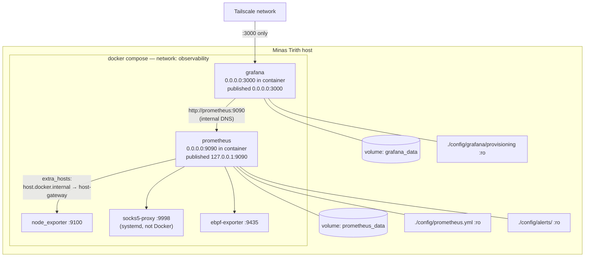

# Docker Compose Network

> Generated during: Session A, Phase 1 — Compose + Config Files
> Last updated: 2026-08-02

Shows the internal Docker Compose network topology for the observability
stack: how the two containers reach each other, how Prometheus reaches
host-level exporters that are not in Docker, and which volumes and
config files are mounted where.

---

## Notes

- Prometheus is published as `127.0.0.1:9090` — reachable from the host
  for local `curl`/debugging, never from Tailscale or the LAN.
- Grafana is published as `0.0.0.0:3000` and is the only container
  exposed beyond localhost; Tailscale ACLs (not shown) are what actually
  restrict who on the tailnet can reach it.
- `host.docker.internal` requires the explicit `extra_hosts:
  host.docker.internal:host-gateway` entry on the `prometheus` service
  because this is Linux Docker Engine, not Docker Desktop — without it
  the three host-level exporter scrapes would fail DNS resolution.
- `socks5-proxy` runs as a systemd unit directly on the host (it needs
  raw network/eBPF map access), not as a Compose service — it is only
  reachable *from* the compose network, never a member of it.
