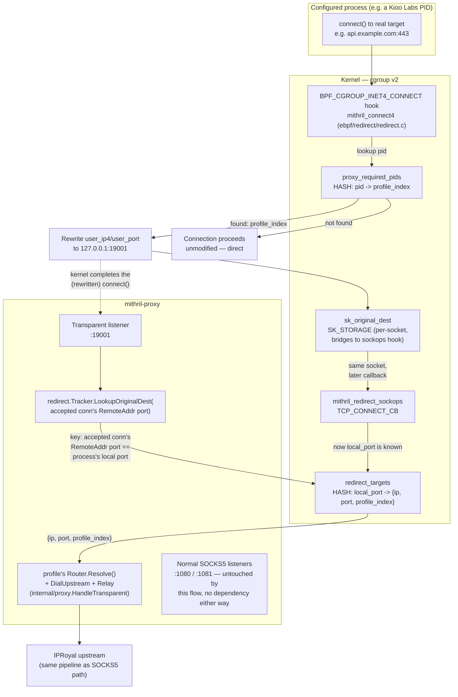

# eBPF Enforcement Flow

> Generated during: Session B, Phase 7 — Traffic Interception Enforcement
> Last updated: 2026-08-02

Shows how an outbound connection attempt from a configured process gets
transparently redirected through the proxy, and how the proxy recovers
the true destination to relay it onward. Deviates from spec section 4
Feature 1's literal mechanism (tc hook on interface egress +
iptables/nftables TPROXY) — see the Notes section for why, agreed with
explicit user sign-off before any of this was built.

---

## Notes

- **Deliberate deviation from spec's literal mechanism, not an
  oversight.** Spec describes a tc eBPF program on interface egress
  plus iptables/nftables TPROXY rules. That approach needs (a) a way to
  correlate a raw packet at the TC layer back to a PID — TC hooks have
  no process context, and spec doesn't specify a mechanism for this —
  and (b) host iptables/nftables and kernel routing-table changes, where
  a misconfiguration risks breaking real network connectivity, not just
  this feature. Discussed explicitly with the user before writing any
  code; the `BPF_CGROUP_INET4_CONNECT` approach was chosen because it
  runs natively in the connecting process's own context (reliable PID
  access, nothing to correlate for *that* part) and touches nothing
  outside eBPF + this Go binary — no iptables, no routing table.
- **"Proxy process exclusion path"** (required by CLAUDE.md's diagram
  description): there's no separate exclusion map. The proxy's own PID
  is simply never written to `proxy_required_pids` — only PIDs listed
  under a profile's `enforce_pids` in `profiles.yaml` ever appear there.
  Since the proxy's own outbound connections (to the IPRoyal upstream)
  are never enforced PIDs, they're never redirected back into this
  same flow — no loop, by construction, not by an explicit check.
- **Redirect target is `:19001` (transparent listener), not `:1080`
  (SOCKS5 listener)** — spec's diagram description says "redirect to
  :1080", but a raw redirected connection can't speak to the SOCKS5
  listener: the connecting process doesn't know it's been redirected,
  so it sends application data (e.g. a TLS ClientHello) directly, not a
  SOCKS5 handshake. `:1080`/`:1081` and `:19001` are entirely separate,
  non-interacting listeners.
- **Two eBPF programs bridge state via `bpf_sk_storage`**, not one
  program doing everything: the connect4 hook fires before the
  connection's local port is assigned, so it can't yet key a plain hash
  map by something the *listener* side can also compute. The sockops
  hook fires slightly later on the *same* underlying socket, once
  `local_port` is known — `sk_original_dest` (SK_STORAGE) is scoped to
  that one socket and lets the second program read what the first one
  wrote.
- **Highest unverified risk of any eBPF phase in this project.** Unlike
  Phase 5 (had a working `cilium/ebpf` reference example) or Phase 6
  (eventually got one narrowed down through live iteration), there is
  no reference example for this specific `connect4` + `sk_storage` +
  second-program-bridge pattern anywhere in the `cilium/ebpf` module
  cache used throughout this build. Compiles clean and the byte-order
  math (`ebpf/redirect/loader.go`'s `decodeOriginalDest`) is unit
  tested against a from-scratch simulation, but none of the actual
  kernel behavior — hook firing order, whether `local_port` is reliably
  set by `TCP_CONNECT_CB` for a rewritten connection, whether
  `bpf_sk_storage` bridges correctly across these two specific program
  types — has run against a real kernel yet.
