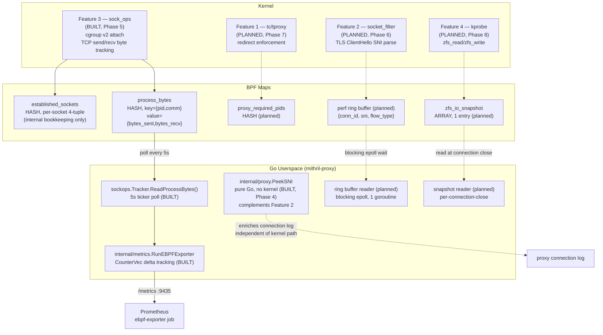

# eBPF Kernel/Userspace

> Generated during: Session B, Phase 5 — eBPF: Per-Process Bandwidth (sock_ops)
> Last updated: 2026-08-02

Shows all five eBPF-adjacent programs from spec section 4, their BPF
maps, and how Go userspace reads each one — perf/ring buffers shown
separately from hash maps since they're read completely differently
(blocking epoll wait vs periodic polling). Only Feature 3 (sock_ops) and
Feature 5 (Go SNI peek, no kernel) are built as of this phase; 2, 1, and
4 are marked planned.

---

## Notes

- **Hash maps vs ring/perf buffers, read differently**: `process_bytes` is
  polled on a 5s ticker (`sockops.Tracker.ReadProcessBytes` →
  `internal/metrics.RunEBPFExporter`) — cheap, bounded, no blocking. The
  planned SNI ring buffer (Feature 2) is read via a single goroutine
  blocking on epoll, woken only when new events arrive — no polling
  overhead, per spec's own resource-cost note.
- `established_sockets` is **not** read by Go at all — it's purely
  kernel-internal bookkeeping the eBPF program uses to correlate later
  callbacks (RTT_CB, STATE_CB) back to the PID/comm captured at
  connect/accept time. Only `process_bytes` crosses into userspace.
- **Known unresolved uncertainty, not glossed over**: PID/comm capture
  for *passive* (inbound/accepted) connections happens at
  `BPF_SOCK_OPS_PASSIVE_ESTABLISHED_CB`, which may not run in the
  accepting process's context (a kernel/softirq event, not a syscall).
  Outbound connections (`BPF_SOCK_OPS_TCP_CONNECT_CB`, fires inside the
  `connect()` syscall) are reliable; inbound-heavy processes like
  `node_exporter` (which is scraped, not scraping) may show wrong or
  missing PIDs until this is verified against a real kernel. Documented
  in `ebpf/sockops/sockops.c`.
- `internal/proxy.PeekSNI` (Phase 4) is drawn as independent of the
  kernel eBPF path deliberately — it's a pure-Go fallback, not something
  Feature 2 depends on or feeds into.
- Feature 5 in spec section 4 numbering *is* the Go SNI peek — this
  diagram's title says "all five eBPF programs" per CLAUDE.md's diagram
  table wording, but Feature 5 itself has no kernel component to draw in
  the `kernel` subgraph, which is why it only appears in `userspace`.
