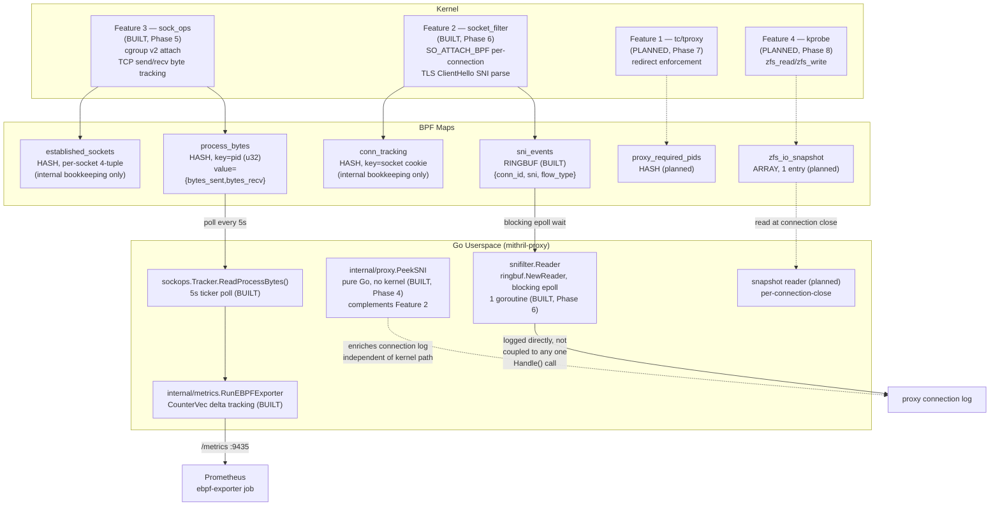

# eBPF Kernel/Userspace

> Generated during: Session B, Phase 5 — eBPF: Per-Process Bandwidth (sock_ops)
> Last updated: 2026-08-02

Shows all five eBPF-adjacent programs from spec section 4, their BPF
maps, and how Go userspace reads each one — perf/ring buffers shown
separately from hash maps since they're read completely differently
(blocking epoll wait vs periodic polling). Updated in Phase 6: Feature 2
(socket_filter) is now built alongside Feature 3 (sock_ops) and Feature
5 (Go SNI peek). Features 1 and 4 remain planned.

---

## Notes

- **Hash maps vs ring/perf buffers, read differently**: `process_bytes` is
  polled on a 5s ticker (`sockops.Tracker.ReadProcessBytes` →
  `internal/metrics.RunEBPFExporter`) — cheap, bounded, no blocking. The
  planned SNI ring buffer (Feature 2) is read via a single goroutine
  blocking on epoll, woken only when new events arrive — no polling
  overhead, per spec's own resource-cost note.
- `established_sockets` is **not** read by Go at all — it's purely
  kernel-internal bookkeeping the eBPF program uses to correlate later
  callbacks (RTT_CB, STATE_CB) back to the PID captured at
  connect/accept time. Only `process_bytes` crosses into userspace.
- **Real correction, confirmed live**: the sock_ops program originally
  also called `bpf_get_current_comm()` in-kernel, alongside PID, keying
  `process_bytes` by `{pid, comm}`. The kernel verifier rejects that
  helper for `BPF_PROG_TYPE_SOCK_OPS` on this kernel (6.12.95+deb13) —
  confirmed via a real privileged load attempt, not a compile-time
  issue. `process_bytes` is now keyed by plain PID; comm is resolved in
  Go via `/proc/<pid>/comm` at read time (`ebpf/sockops/loader.go`).
  Tradeoff: if a short-lived process exits and its PID is reused before
  the next 5s read, the wrong (reused) process's name could be
  attributed — accepted as a rare edge case rather than engineered
  around.
- **Known unresolved uncertainty, not glossed over**: PID capture
  for *passive* (inbound/accepted) connections happens at
  `BPF_SOCK_OPS_PASSIVE_ESTABLISHED_CB`, which may not run in the
  accepting process's context (a kernel/softirq event, not a syscall).
  Outbound connections (`BPF_SOCK_OPS_TCP_CONNECT_CB`, fires inside the
  `connect()` syscall) are reliable; inbound-heavy processes like
  `node_exporter` (which is scraped, not scraping) may show wrong or
  missing PIDs until this is verified against a real kernel. Documented
  in `ebpf/sockops/sockops.c`.
- `internal/proxy.PeekSNI` (Phase 4) is drawn as independent of the
  kernel eBPF path deliberately — it's a pure-Go fallback, not something
  Feature 2 depends on or feeds into.
- Feature 5 in spec section 4 numbering *is* the Go SNI peek — this
  diagram's title says "all five eBPF programs" per CLAUDE.md's diagram
  table wording, but Feature 5 itself has no kernel component to draw in
  the `kernel` subgraph, which is why it only appears in `userspace`.
- **Feature 2's biggest open uncertainty, Phase 6**: the program is
  attached directly to the client-facing TCP socket via
  `link.AttachSocketFilter` (`SO_ATTACH_BPF`), not a raw `AF_PACKET`
  capture. The assumption baked into `snifilter.c`'s parsing entry
  point is that by the time a socket filter runs on a connected TCP
  socket's receive path, `skb->data` already points at the application
  payload (protocol headers stripped) — the same starting point
  `internal/proxy/sni.go`'s parser expects. Kernel documentation doesn't
  state this explicitly for TCP sockets specifically (it's well
  documented for `AF_PACKET`, not for this attachment style); this is
  reasoned from how `sock_queue_rcv_skb` fits into the TCP receive path,
  not confirmed against a working reference example the way Phase 5's
  `sock_ops` fix was. First thing to check if a live test extracts
  garbage/empty SNI on connections known to carry TLS: try skipping a
  fixed header-size offset (e.g. 54 bytes for Ethernet+IPv4+TCP) before
  parsing instead.
- **Flow classification is deliberately partial**: only `FLOW_IMAGE_UPLOAD`
  (total bytes over 100KB within `MAX_PACKETS_BEFORE_CLASSIFY` packets)
  is actually assigned by `snifilter.c`. `FLOW_API_CALL` and
  `FLOW_TELEMETRY` are defined (matching spec's four named types) but
  never produced — both need signals this receive-side, per-connection
  filter structurally can't see: bidirectional byte counts (only inbound
  is visible here) and/or cross-connection frequency ("New Relic
  pattern" implies watching multiple connections over time). Both
  surface as `FLOW_UNKNOWN`. Finer classification is Go-side future
  work, not attempted in-kernel.
