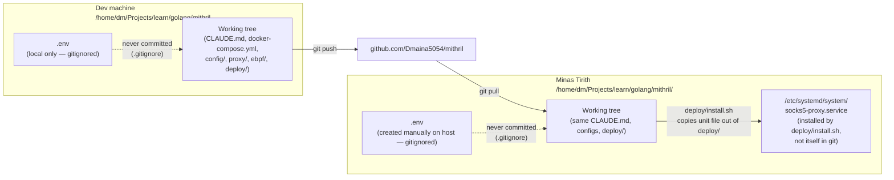

# Git Workflow

> Generated during: Session A, Phase 1 — Compose + Config Files
> Last updated: 2026-08-02

Shows how code moves from the dev machine to Minas Tirith via GitHub,
and — just as importantly — what does *not* travel through git: secrets
stay in `.env` files on each host, while `CLAUDE.md` context files and
systemd unit definitions are versioned and land wherever the repo is
cloned.

---

## Notes

- `.env` files are host-local and re-created by hand (or by a secrets
  tool, not shown) on each machine — `.env.example` is what actually
  travels through git as the template.
- `CLAUDE.md` at every level (repo root, `observability/`, `proxy/`) is
  a normal tracked file — it's meant to arrive on Minas Tirith identical
  to the dev-machine copy so Claude Code sessions there have the same
  context.
- systemd unit files live under `deploy/` in git as templates; the
  *installed* unit in `/etc/systemd/system/` is a copy placed there by
  `deploy/install.sh`, not a symlink back into the repo — editing the
  installed unit directly will not update the tracked template.
- This diagram covers only the dev-machine → Minas Tirith path described
  in CLAUDE.md's deploy target; it does not show CI, since none is
  defined for this personal-infra repo.
