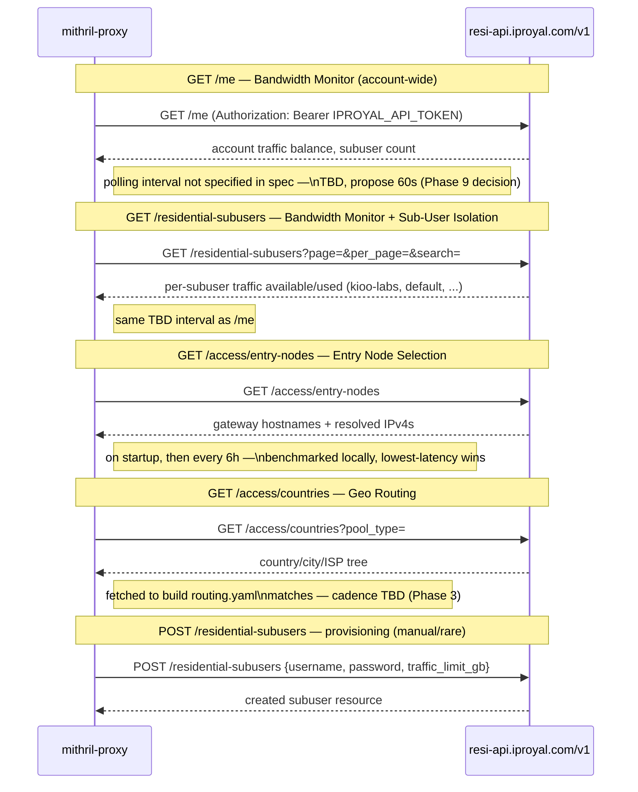

# IPRoyal API Integration

> Generated during: Session B, Phase 1 — IPRoyal API Client
> Last updated: 2026-08-02

Shows how the proxy talks to IPRoyal's residential API (`resi-api.iproyal.com`)
across all four endpoints used by the build: what triggers each call, what
data flows in which direction, and on what cadence.

---

## Notes

- All 4 read endpoints are confirmed against IPRoyal's public OpenAPI
  docs at `resi-api.iproyal.com/docs` (base path `/v1`, `/me` is a
  deprecated alias for `/v1/residential/me`, entry-nodes returns a bare
  JSON array not wrapped in a `data` envelope).
- **Auth header is unverified.** The client implements
  `Authorization: Bearer <IPROYAL_API_TOKEN>` as the standard REST
  convention — IPRoyal's docs don't state the header explicitly. First
  thing to check if `apismoke` comes back 401.
- Response field names (traffic balance, subuser fields) are also
  unverified — the client decodes into `map[string]any` rather than
  strict typed structs so `apismoke` can print real data on first run
  regardless of exact field names, rather than silently mismatching.
- Polling intervals: only entry-node benchmarking has a spec'd cadence
  (startup + every 6h). Bandwidth Monitor's poll interval for `/me` and
  `/residential-subusers` isn't specified anywhere in the infra spec —
  needs a decision before Phase 9 wires these into Prometheus metrics.
- `POST /residential-subusers` (sub-user creation) is shown for
  completeness but isn't expected to run automatically — sub-users are
  created manually in the IPRoyal dashboard (see AI-03), this endpoint
  exists in the client mainly for programmatic parity with the API.
