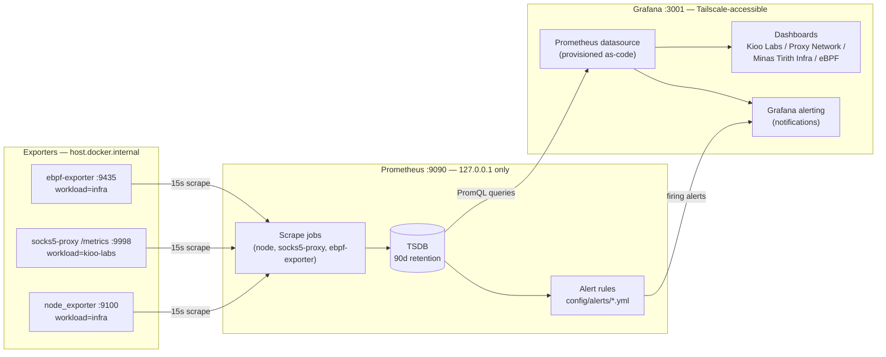

# Observability Data Flow

> Generated during: Session A, Phase 1 — Compose + Config Files
> Last updated: 2026-08-02

Shows how metrics move from exporters on Minas Tirith through Prometheus
scraping, into Grafana as a datasource, out to provisioned dashboards,
and how alert rule evaluation feeds Grafana alerting. This is the shape
that every future workload (Gondor, Hermes) plugs into without any new
Prometheus or Grafana instance.

---

## Notes

- Every scrape target and dashboard panel carries `node=` and
  `workload=` labels — that's the entire separation mechanism for
  multi-tenant data in one Prometheus/Grafana pair.
- Alert rule *evaluation* happens inside Prometheus (`rule_files` in
  `prometheus.yml`); Grafana alerting here refers to how firing alerts
  surface to a human — Grafana reads Prometheus's `ALERTS` series via
  the datasource, it does not duplicate rule evaluation.
- Future nodes (Gondor, Hermes) add a new scrape job under `exporters`
  and, if needed, a new dashboard folder — no new boxes in the
  Prometheus/Grafana tier of this diagram.
