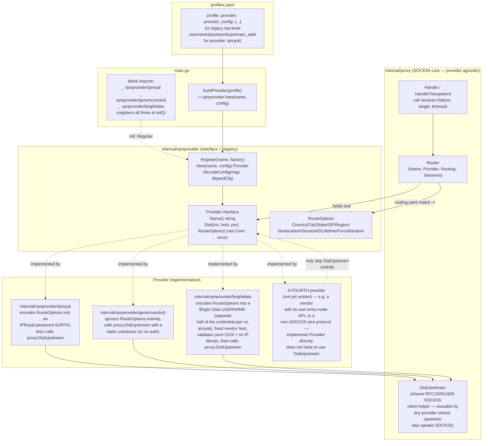

# Provider Plugin Architecture

> Generated during: unscheduled — `internal/vpnprovider` plugin layer.
> Not one of the original Session B phases in `docs/mithril-infra-spec.docx`
> (that spec assumes IPRoyal throughout); added afterward so upstream
> VPN/residential-proxy vendors beyond IPRoyal can be hooked in without
> touching `internal/proxy`.
> Last updated: 2026-08-19 — added `internal/vpnprovider/brightdata` as
> a real third-party integration test of the plugin boundary (see Notes).

Shows the plugin boundary this refactor introduced between the SOCKS5
core (`internal/proxy`) and any upstream VPN/proxy vendor
(`internal/vpnprovider` and its subpackages). Before this existed,
`internal/proxy.Router` built IPRoyal's password-suffix credentials and
dialed a fixed upstream directly — IPRoyal was load-bearing throughout
the SOCKS5 core for no structural reason. Now `internal/proxy` depends
only on the `vpnprovider.Provider` interface; IPRoyal is one
implementation of it, registered the same way a second, third, or
Nth provider would be.

---

## Notes

- **The interface is intentionally small.** `Provider` has exactly two
  methods: `Name()` for logging, and `Dial(ctx, host, port,
  RouteOptions) (net.Conn, error)`. Everything upstream-specific —
  credential encoding, entry-node selection, the actual wire protocol —
  is the implementation's problem, not the interface's. `internal/proxy`
  never imports a specific provider package; it imports only
  `internal/vpnprovider` for the interface and `RouteOptions` type.
- **`RouteOptions` fields are best-effort, not a contract every provider
  must honor.** A provider that can't act on a field (or doesn't
  support per-request targeting at all — see `genericsocks5`) is
  expected to silently ignore it, not error. This is what lets
  `routing.yaml` stay one shared config across every profile regardless
  of which provider that profile uses.
- **Registration is compile-time, not dynamic.** `Register` is called
  from each provider package's `init()`; `main.go` blank-imports every
  provider package it wants compiled into the binary. This mirrors
  `database/sql`'s driver registry. There is no support for loading a
  provider `.so` at runtime (Go's `plugin` package is fragile and
  toolchain/OS-version sensitive) — "pluggable" here means "implement
  one interface, register it, blank-import it, redeploy," not
  hot-swapping.
- **`DialUpstream` (in `internal/proxy`) is reusable, not IPRoyal-
  specific.** It's a generic RFC 1928/1929 SOCKS5 client implementation.
  Both reference providers happen to use it because both upstreams
  (IPRoyal's gateway, and whatever `genericsocks5` points at) speak
  SOCKS5 — but nothing requires a new provider to use it. A provider for
  a vendor with an HTTP CONNECT proxy, or a provider that manages its
  own WireGuard interface and just does a plain `net.Dial` to the real
  target, implements `Dial` however it needs to and never touches
  `DialUpstream`.
- **Backward compatibility for existing `profiles.yaml` files.** A
  profile that omits `provider` is assumed to be `iproyal`, and its
  top-level `username`/`password`/`subuser_hash`/`upstream_addr` fields
  are synthesized into that provider's config by `main.go`'s
  `buildProvider` — no existing profile needs to change. New profiles,
  or any profile naming a different provider, use `provider` +
  `provider_config` instead (see `config/profiles.yaml.example`).
- **What adding a real third-party VPN actually takes:** write a new
  `internal/vpnprovider/<name>` package implementing `Provider`,
  register it in `init()`, blank-import it from `main.go`, and add a
  `provider_config` shape to `profiles.yaml`. If that vendor's upstream
  speaks SOCKS5 with RFC 1929 auth, reuse `proxy.DialUpstream` like both
  reference providers do; if it needs its own entry-node discovery
  (like `internal/iproyal.Client` does for IPRoyal, though that client
  isn't wired into the hot path yet either) or a different wire
  protocol, that logic lives entirely inside the new package.
- **`internal/vpnprovider/brightdata` is the actual proof of that last
  bullet**, not just a description of it — a real vendor (Bright Data),
  confirmed against its live docs (docs.brightdata.com), added purely
  to stress-test the plugin boundary rather than to fill a specific
  operational need. It turned out to differ from IPRoyal in exactly
  the ways worth testing:
  - **Targeting lives in the USERNAME, not the password.** IPRoyal's
    `buildPassword` appends `_country-us_session-abc123` to the
    password; Bright Data's `buildUsername` appends
    `-country-us-session-abc123` to the username instead, and the
    password is sent completely unmodified. `RouteOptions` didn't need
    a single field changed to support either direction — it's the
    provider's `Dial` that decides which half of the credential pair
    carries what.
  - **No per-account entry-node discovery.** IPRoyal's `Config` needs
    an operator-supplied `upstream_addr` (an entry node — see
    `iproyal-api-integration.md`); Bright Data's proxy is a single
    fixed vendor host (`brd.superproxy.io:22228` for SOCKS5), so
    `brightdata.Config` doesn't have a required upstream-address field
    at all (only an optional override, mainly for tests).
  - **Real vendor-specific constraints, enforced before the dial, not
    after.** Bright Data's SOCKS5 endpoint rejects target ports ≤ 1024
    and IP-literal targets outright; `brightdata.Provider.Dial`
    validates both and returns a clear error naming the constraint,
    rather than letting the real upstream fail confusingly.
  - **No lifetime or force-random equivalent.** Bright Data controls
    sticky-session duration from the zone dashboard, not a per-request
    username parameter — `RouteOptions.Lifetime`/`ForceRandom` are
    silently ignored here, the same "ignore what you can't act on"
    contract `genericsocks5` already demonstrated for the "ignore
    everything" extreme.
  - It still reuses `proxy.DialUpstream` — Bright Data's SOCKS5
    endpoint is standard RFC 1928/1929, so the wire protocol itself
    needed nothing new.
- This diagram doesn't cover `internal/iproyal.Client` (the REST API for
  `/me`, `/access/entry-nodes`, `/residential-subusers`,
  `/access/countries`) — see `docs/diagrams/iproyal-api-integration.md`.
  That client is IPRoyal-specific by nature (it's IPRoyal's own account/
  management API, not a proxying concern) and isn't part of the
  `Provider` interface; the `iproyal` provider package doesn't call it
  today, matching `internal/iproyal`'s existing "not wired into the hot
  path" status.
