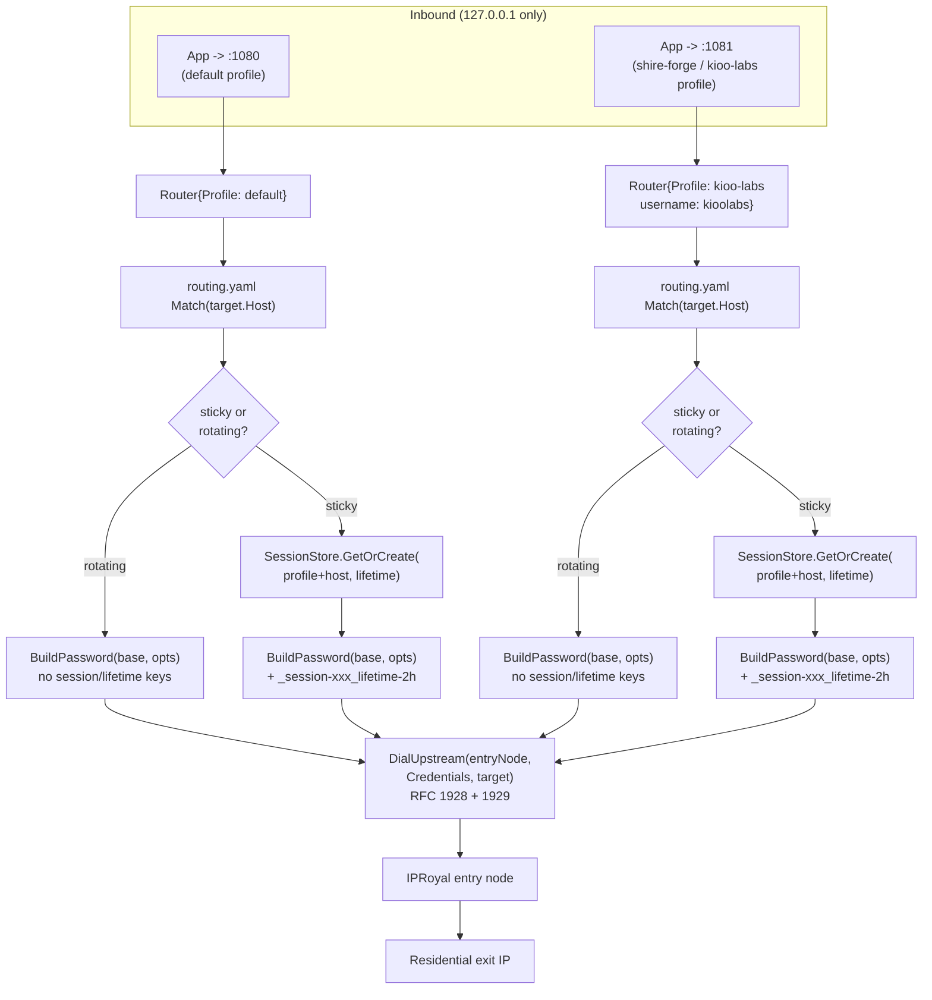

# Sub-User Routing

> Generated during: Session B, Phase 3 — Router
> Last updated: 2026-08-02

Shows how an inbound connection on either listen port becomes an
authenticated, geo/session-targeted upstream connection: profile lookup
by port, routing.yaml pattern match against the destination hostname,
credential construction (IPRoyal's password-suffix syntax, confirmed
against docs.iproyal.com), then the RFC 1928/1929 dial built in Phase 2.

---

## Notes

- Profile selection is purely by which port accepted the connection —
  `main.go` starts one `net.Listener` per `profiles.yaml` entry, each
  wrapped in its own `Router`. There's no cross-port fallback.
- `routing.yaml`'s `Match` uses `path.Match` glob semantics: `*` matches
  across dots, not just one DNS label — `*.example.com` matches both
  `api.example.com` and `a.b.example.com`. Documented in
  `config/routing.go` since it differs from typical wildcard-cert
  intuition.
- Sticky sessions are keyed by `profile-username|destination-host` in
  `SessionStore` — the same app hitting the same host within the
  lifetime window reuses the same IPRoyal session ID (same exit IP);
  different hosts get independent sessions even under the same profile.
- The geo/session suffix is appended to IPRoyal's **password** field,
  not the username — confirmed against
  `docs.iproyal.com/proxies/residential/proxy/location` and `.../rotation`,
  not assumed. Example: `kioolabs-basepass_country-us_session-a1b2c3d4_lifetime-2h`.
- `UpstreamAddr` (the IPRoyal entry node) is still a fixed value passed
  via `MITHRIL_UPSTREAM_ADDR` — Phase 1's entry-node benchmarking exists
  as a client capability but isn't wired into automatic startup/6h
  re-selection yet. Follow-up work, not part of this diagram's flow.
- `profiles.yaml` (real passwords) is gitignored; `profiles.yaml.example`
  is the tracked template, same pattern as `observability/.env.example`.
